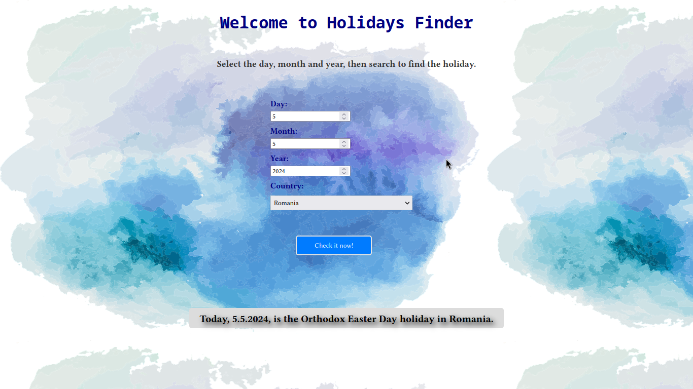

##HoliDates

API Holidays provides information about holidays worldwide. With this API, users can access data on public holidays, observances, and special events across various countries and regions.




##Usage

1. Clone this repository to your local machine:

```bash
git clone https://github.com/scriubuguri/HoliDates.git
```

2. Create a virtual environment with the following command:

```bash
python3 -m venv venv
```

3. Activate the virtual environment:

```bash
source venv/bin/activate
```

4. Install dependencies

```bash
pip install -r requirements.txt
```

5. visit [Abstract API](https://app.abstractapi.com/dashboard) and follow the steps to register and obtain an API key. After you have obtained the API key, configure the `your_api_key` variable in the `views.py` file with your key.

6. Before run the app, open the `HoliDates` folder (where you have the `manage.py` file) and apply the migrations:

```bash
python3 manage.py migrate
```

Run the app with the following command:

```bash
python3 manage.py runserver
```

7. Open your browser and select the date to find the holiday


## Author

- **scriubuguri**

## License

This project is licensed under the GPL-3.0 License - see the [LICENSE](https://github.com/scriubuguri/HoliDates/blob/master/LICENSE) file for details.
